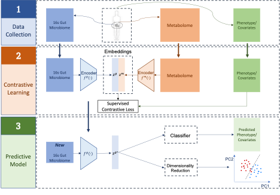

# MB-SupCon: Microbiome-based predictive models via Supervised Contrastive Learning

### Reference

```
@article{yang2022mb,
    title     ={MB-SupCon: Microbiome-based Predictive Models via Supervised Contrastive Learning},
    author    ={Yang, Sen and Wang, Shidan and Wang, Yiqing and Rong, Ruichen and Kim, Jiwoong and Li, Bo and Koh, Andrew Y and Xiao, Guanghua and Li, Qiwei and Liu, Dajiang J and others},
    journal   ={Journal of Molecular Biology},
    volume    ={434},
    number    ={15},
    pages     ={167693},
    year      ={2022},
    publisher ={Elsevier}
  }
```

## Introduction

The human microbiome consists of trillions of microorganisms cohabitating a variety of body niches. Microbiota can modulate the host physiology through microbiota-derived molecule and metabolite interactions. Microbiome-based biomarkers have great potential for numerous disease states but current approaches have yielded limited success. 

Here, we propose a novel integrative modeling framework, Microbiome-based Supervised Contrastive Learning Framework (MB-SupCon) to improve microbiome-based prediction models. By integrating microbiome and metabolomics data under a supervised contrastive learning scheme, MB-SupCon trained two encoder networks to maximize the similarity between microbiome embedding and metabolomics embedding. Compared to the original microbiome data, the microbiome embedding can lead to improved prediction performances.

<p align="center">
  
</p>

<p align = "center">
<b>Fig.1</b> MB-SupCon: Microbiome-based Supervised Contrastive Learning Framework
</p>

## About this repository

**Folders**

"data" folder includes:

1. Raw gut 16s microbiome data and metabolome data;

2. Clinical covariates data of all subjects;

3. Index labels for training, validation and testing datasets used for `mixOmics` methods;

4. Output of `mixOmics` methods (sPLSDA, sPLS and DIABLO).

"`tuning`" folder includes the Jupyter Notebooks for tuning and result visualization. All tuning results are saved in "tuning/save_tuning" folder;

*(Note: detailed tuning results are not included in this repository because of the huge amount and size of the files. You can easily reproduce the tuning results by running notebooks `1b-i - tune with random seeds 1-3.ipynb`, `1b-ii - tune with random seeds 4-6.ipynb`, `1b-iii - tune with random seeds 7-9.ipynb` and `1b-iv - tune with random seeds 10-12.ipynb`.)*

"`embeddings`" folder includes feature embedding by MB-SupCon in representation space for all covariates.

"`figures`" folder includes all loss curves of MB-SupCon and generated lower-dimensional scatter plots by different methods including MB-SupCon. 

"`models`" folder includes trained models. 

"`outputs`" folder includes the output PC1 and PC2 scores (by PCA) used for lower-dimensional scatter plots.

"`other_methods`" folder includes the codes, plots and outputs of the other methods including MLP, MB-simCLR, `mixOmics` methods (sPLSDA, sPLS and DIABLO) for comparison with MB-SupCon.

**Codes**

`1a - MB-SupCon_categorical covariates.ipynb`: the main Jupyter Notebook used to 

1. Train MB-SupCon models for different covaraites;

  *(Note: the best combination of hyperparameters are chosen based on the tuning result. Details can be found in the Jupyter Notebook located at `./tuning/1b-v - save and visualize the tuning results_random seeds_1-12.ipynb`.)*

2. Output and save corresponding feature embedding in the representation domain;

3. Make predictions of different covariates based on embedding of MB-SupCon and original data, and calculate the average prediction accuracy on testing datasets from multiple training-validation-testing splits;

3. Generate scatter plots on lower-dimensional space by PCA.

*(Note: you can choose other dimensionality reduction techniques, such as t-SNE and UMAP)*.

`supervised_loss.py`: a function used for calculating supervised contrastive loss;

`plotting_utils.py`, `pred_utils.py`, `utils_eval.py`: utility functions;

`mbsupcon.py`: the python script for building a MB-SupCon model;

`mbsimclr.py`: the python script for building a MB-simCLR model.

## System information and packages versions 

- System information:

System: `Linux`; Release: `3.10.0-957.el7.x86_64`;

GPU: `Tesla V100-SXM2-32GB`.

- Version of Python and some important packages used in this repository:

Python version: `3.8.5`.

`pytorch`: `1.7.1` (Build: `py3.8_cuda11.0.221_cudnn8.0.5_0`);

`numpy`: `1.19.2`;

`pandas`: `1.2.1`;

`scikit-learn`: `0.23.2`;

`matplotlib`: `3.3.2`;

`seaborn`: `0.11.2`.

## Contacts

**Sen Yang:**

senyang@smu.edu | sen.yang@utsouthwestern.edu

Department of Statistical Science

Southern Methodist University

Dallas, TX 75275

---

**Xiaowei Zhan:**

xiaowei.zhan@utsouthwestern.edu

Quantitative Biomedical Research Center, Department of Population and Data Sciences

Center for Genetics of Host Defense

University of Texas Southwestern Medical Center

Dallas, TX 75390


